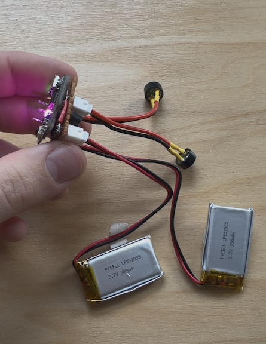

## The Music Box (Musical Beeper)

This repository contains the code for my musical beeper, which I made to help me recover rockets after they'd landed in exotic places like corn fields and forests around my launch site. I made my own custom computer-friendly musical notation (it looks like this: `g-5-16 b#4-* c-5-* db5-*`) to let me configure any melody that tickled my fancy.

